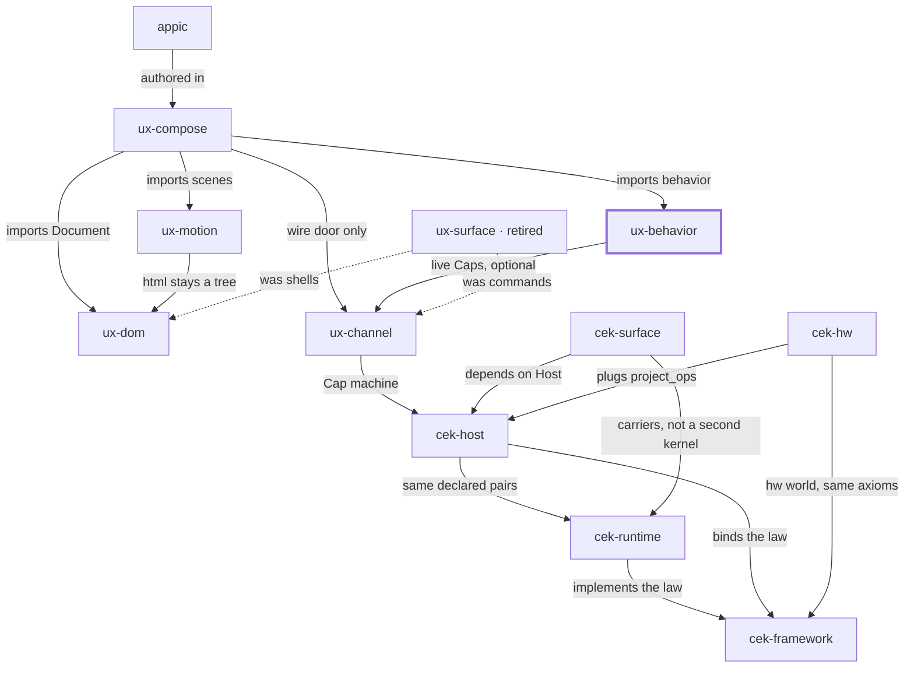

# Place in the stack

**You are here:** `ux-behavior` in [bitplorer/ux-behavior](https://github.com/bitplorer/ux-behavior).

Product behavior. A component, an action, and Morph or Ref state become a verified list of ops. Markup stays in ux-dom. The wire stays in ux-channel.

The picture is the same in every repo. The thick stroke is this library. A missing line is a missing door, not a forgotten one. Dashed lines are history.

## Owns

Components, @action, Morph and Ref, and validation of the ops a behavior may emit.

## Refuses

Raw HTML construction and wire codecs.

## Install

pip install ux-behavior. Import ux_behavior. CLI uxbehavior.

## Doors

### Uses

- [ux-channel](https://github.com/bitplorer/ux-channel) — live Caps, optional

### Used by

- [ux-compose](https://github.com/bitplorer/ux-compose) — imports behavior

## The stack

## The walk

Mint, intent, verify, project, apply, undo.

1. **Mint.** Host mints a Cap. The subject on the Cap is the subject in the args. dev is the workshop. prod refuses the workshop secret.
2. **Intent.** Channel carries action, args, and cap. That is the click. It is not a form post.
3. **Verify.** Host verifies the Cap before any shared-world write. A bad Cap, or a store that is down, refuses. ops is empty. The peer never mints.
4. **Project.** Only declared pairs leave the host. Baseline and ui.dom are the catalog. Hardware pairs arrive through project_ops. They are not a fork of Host.
5. **Apply.** The peer applies the ops. DOM is one world. GPIO is another. Surface carries the IR. It does not decide.
6. **Undo.** Lineage records the cause. End or revoke reverses it, or the op is marked non-reversible. A trace id never grants permission.

ux-behavior is where an author action is born. Channel is what signs it.

## Notes

- Live Caps are optional. They come from ux-channel.
- An offline component does not need a socket.
