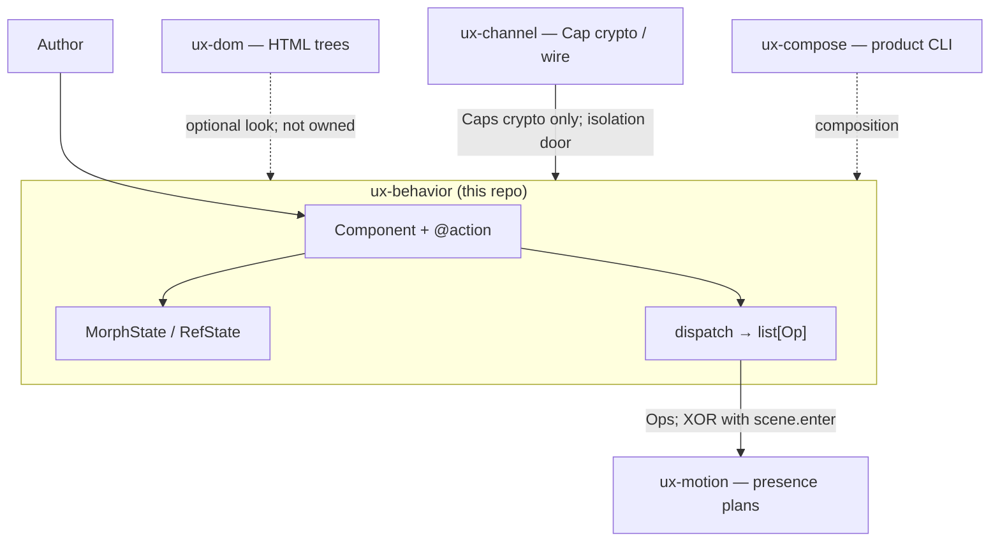

# C4-style overview — ux-behavior

> **Diátaxis:** explanation · **Canonical:** `docs/internals/c4.md` · **Layer:** ux-behavior
> Map: [../INDEX.md](../INDEX.md).

Grounded in [../../DESIGN.md](../../DESIGN.md) and [ARCHITECTURE.md](ARCHITECTURE.md).
This layer owns product behavior → verified `list[Op]`.
It does **not** own raw HTML construction or wire codecs.

## Context

XOR (one Result): `morph(T)` XOR `scene.enter(T, html=…)`. Do not invent a sixth product.
